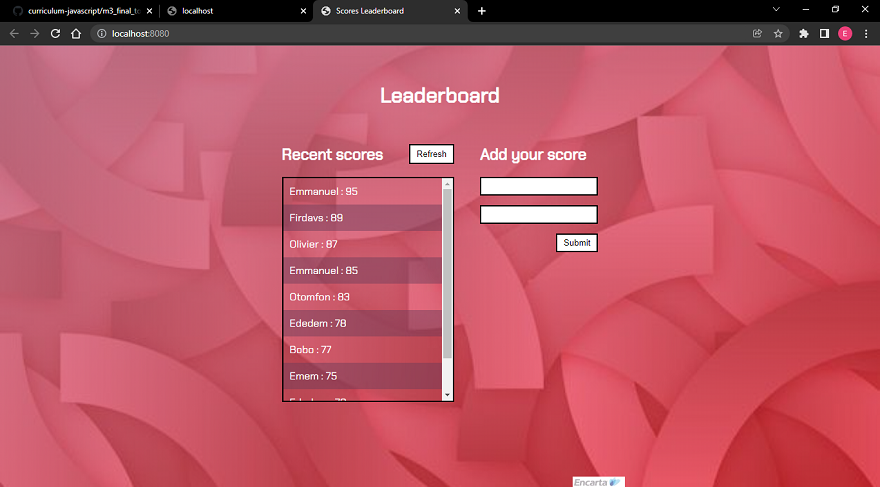

# Leaderboard

This Leaderboard is designed to provide users a convenient way to keep record of their scores.

## Built With

- HTML
- CSS
- JavaScript
- Webpack
- JSON
- API
- Linters

## Instructions to run locally:
### To run locally you should have npm and node in your machine
1. Clone the project using git.
2. write npm install in your terminal to install dependencies
3. write npm start to see the output.

## Live Demo

[Go Live](https://epaltechs.github.io/Leaderboard/dist)

## Author

👤 **Emmanuel Paul**

- GitHub: [Emmanuel Paul](https://github.com/Epaltechs/Leaderboard)
- Twitter: [Emmanuel Paul][http://twitter.com/@emmapaul247]
- LinkedIn: [Emmanuel Paul][https://www.linkedin.com/in/emmanuel-paul-a2bab7b4/]

## 🤝 Contributing

Contributions, issues, and feature requests are welcome!

Feel free to check the [issues page](https://github.com/Epaltechs/Leaderboard/issues).

## Show your support

Give a ⭐ if you like this project!

## 📝 License

This project is [Minimalist](https://web.archive.org/web/20180320194056/http://www.getminimalist.com:80/) licensed.
